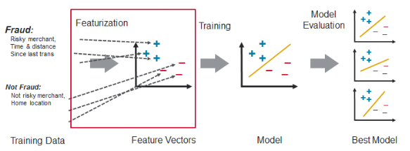

# Fraud detection using big data with PySpark

The picture is referenced [here](https://mapr.com/blog/real-time-credit-card-fraud-detection-apache-spark-and-event-streaming/).

## Background

There is a lack of public available datasets on financial services and specially in the emerging mobile money transactions domain. Financial datasets are important to many researchers and in particular to us performing research in the domain of fraud detection. Part of the problem is the intrinsically private nature of financial transactions, that leads to no publicly [available datasets](https://www.kaggle.com/ntnu-testimon/paysim1).

A synthetic dataset were generated using the simulator called PaySim. PaySim uses aggregated data from the private dataset to generate a synthetic dataset that resembles the normal operation of transactions and injects malicious behaviour to later evaluate the performance of fraud detection methods.

## Goal
The goal of this analysis is to develop a generalized model to deal with **big and imblance data** prediction that suitable to real-world applications. The big data part was sloved by using the pysark.

## Data
The data was downloaded from [here](https://www.kaggle.com/ntnu-testimon/paysim1)

The explanation columns of the input data:

**One row**: 1,PAYMENT,1060.31,C429214117,1089.0,28.69,M1591654462,0.0,0.0,0,0

**Column names**: 

* step - maps a unit of time in the real world. In this case 1 step is 1 hour of time. Total steps 744 (30 days simulation).

* type - CASH-IN, CASH-OUT, DEBIT, PAYMENT and TRANSFER.

* amount - amount of the transaction in local currency.

* nameOrig - customer who started the transaction

* oldbalanceOrg - initial balance before the transaction

* newbalanceOrig - new balance after the transaction

* nameDest - customer who is the recipient of the transaction

* oldbalanceDest - initial balance recipient before the transaction. Note that there is not information for customers that start with M (Merchants).

* newbalanceDest - new balance recipient after the transaction. Note that there is not information for customers that start with M (Merchants).

* isFraud - This is the transactions made by the fraudulent agents inside the simulation. In this specific dataset the fraudulent behavior of the agents aims to profit by taking control or customers accounts and try to empty the funds by transferring to another account and then cashing out of the system.

* isFlaggedFraud - The business model aims to control massive transfers from one account to another and flags illegal attempts. An illegal attempt in this dataset is an attempt to transfer more than 200,000 in a single transaction.

The structure of the notebook is borrowed from [here](https://www.kaggle.com/arjunjoshua/predicting-fraud-in-financial-payment-services), which used pandas and sklearn to conduct the fraud detection. 

## Method overviews

1 Data understanding using PySpark

2 Data conversion and feature enginnering

3 Data stratified splitting and Model building

4 Pipeline and cross validation

5 Model evaluation

